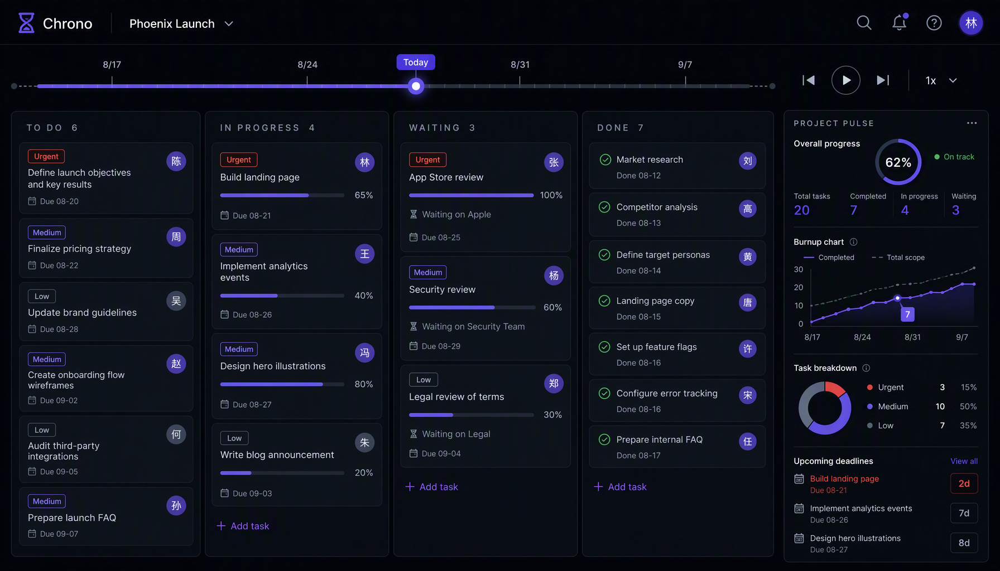
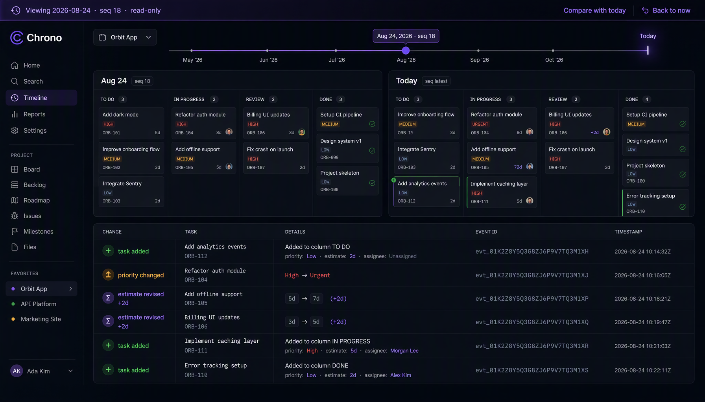
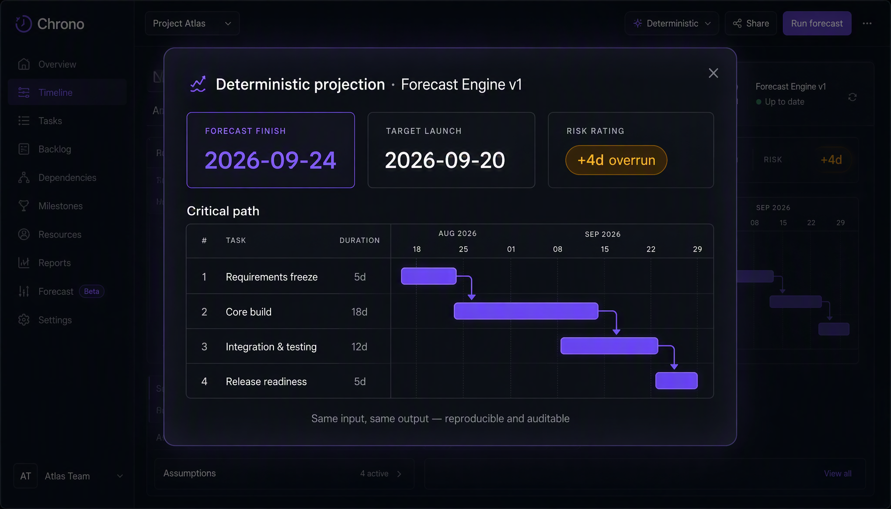

# Chrono — Temporal Decision Workspace

**Replay the past. Understand the present. Rehearse and forecast the future.**

Chrono turns your project into a timeline of immutable events. Boards, diffs, scenarios, forecasts, and AI explanations are all projections of the same event stream — so every answer about your project comes with evidence, not memory.

> **Pre-launch.** Links below go live at deployment. Visuals are illustrative pre-launch renders.

**[Try the live demo →](https://[PLACEHOLDER-HOST]/demo)** · **[Launch the app →](https://[PLACEHOLDER-HOST])**

## Why time is the missing dimension

Project tools show you *now*. But the decisions you actually make are about time:

- *"Why did the launch slip two weeks?"* — Chrono replays the exact sequence of estimate revisions and scope changes that caused it.
- *"What if we add two engineers?"* — Chrono rehearses it in a scenario branch before you commit.
- *"Can we still make the date?"* — Chrono projects it deterministically, with the critical path and the risk in days.

## See it working

### Replay & Compare — hold plans to evidence

Scrub the Temporal Rail to any moment and see the board exactly as it was. Compare any two points in time with a structured, event-level diff: what was added, re-prioritized, re-estimated, and when.

### Forecast — dates you can defend

A deterministic projection engine: topological order, capacity-aware working days, critical path, risk rating. Same input, same output — reproducible and auditable.

### Scenarios — rehearse before you commit

Branch off main, test staffing or scope changes in isolation, compare the branch against main, and apply it back as replayed commands when you're satisfied. Main is untouched until you say so.

### AI explain — answers with receipts

Ask *"why did the launch move?"* and get an answer grounded in the event trail, every claim linked to the events that prove it. Works with any OpenAI-compatible provider; degrades to deterministic analysis without a key.

### Built for everyday teamwork

- Four views: Board, Table, Calendar, Dependency canvas
- Realtime collaboration with presence (SSE)
- Offline mode: edits queue locally and sync idempotently when you're back
- Trash with restore, per-task activity history derived from the event log

## Who it's for

Anyone who plans or delivers software: product managers, engineering managers, product leads, tech leads, founders — or a whole team trying out a time-aware way of working together.

## Try it & give feedback

This is a personal project I built because I wanted project history to be a first-class feature, not a changelog footnote. The best way to help is to try it and tell me what feels right or wrong:

- **Try the live demo** — [https://[PLACEHOLDER-HOST]/demo](https://[PLACEHOLDER-HOST]/demo), no setup needed
- **Open an issue** on this repo — bugs, ideas, and "this confused me" reports are all welcome
- **Email me** — [PLACEHOLDER-EMAIL]

## Built with

Next.js · React · TypeScript · PostgreSQL · Prisma · event sourcing · deterministic forecast engine · Vitest

The core is an append-only event log: every change is an immutable event, and everything you see is a projection of that log — which is also why replay, compare, and scenarios are possible at all. Sessions are SHA-256-hashed server-side, all input is validated, and mutating APIs are same-origin enforced.

---

Chrono — work isn't only about now.
